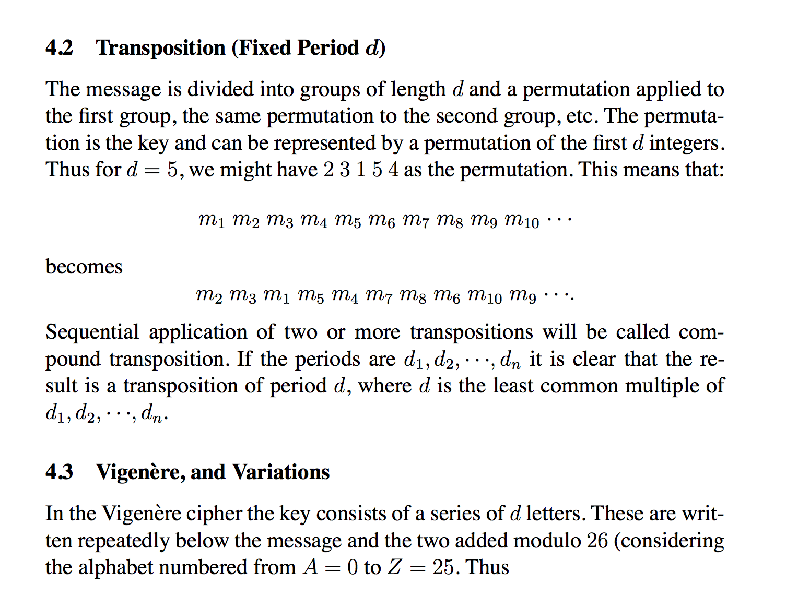
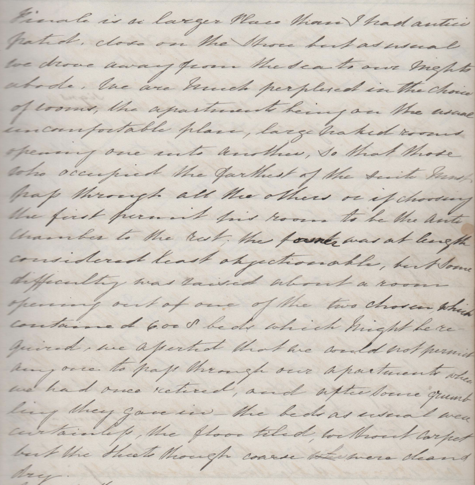

# diaries_project

<BIG>
D&nbsp;E&nbsp;C&nbsp;E&nbsp;M&nbsp;B&nbsp;E&nbsp;R&nbsp;&nbsp;&nbsp;1&nbsp;5&nbsp;t&nbsp;h&nbsp;&nbsp;&nbsp;2&nbsp;0&nbsp;1&nbsp;7</BIG>

        

<pre><code>>>> try:
...     import Image
... except ImportError:
...     from PIL import Image
... 
>>> import pytesseract
>>> </code></pre> 

<code>test_page1.png</code>

        
        

 
        
<pre><code>>>> print(pytesseract.image_to_string(Image.open('test_page1.png')))</code></pre>

<pre><code>4.2 Transposition (Fixed Period d)

The message is divided into groups of length d and a pennutation applied to
the first group, the same pennutation to the second group, etc. The pennuta—
tion is the key and can be represented by a pennutation of the first d integers.
Thus for d = 5, we might have 2 3 1 5 4 as the pennutation. This means that:

m1m2m3m4m5m6m7m8m9m10‘”

becomes
m2 m3 m1 m5 m4 m7 m8 m6 m10 m9 ---.

Sequential application of two or more transpositions will be called com—
pound transposition. If the periods are d1, d2, - - -, d” it is clear that the re—
sult is a transposition of period d, where d is the least common multiple of

d17d27 ' ' '7dn-

43 Vigenére, and Variations

In the Vigenere cipher the key consists of a series of d1etters.These are writ—

ten repeatedly below the message and the two added modulo 26 (considering
the alphabet numbered from A = 0 to Z = 25. Thus
>>> </code></pre> 
     
        
<code>fulltestpage.png</code>

        
        

         
        
<pre><code>>>> print(pytesseract.image_to_string(Image.open('fulltestpage.png')))</code></pre>
        
        
<pre><code>, NcoM/aé M/7% Mag
Mapiéng/ ..~y./¢.,y/2fi,,,.., %"A%
M AW ZMA/ fluMa W

- ,W/b/H ,e, , //4 1;; A4“;
7“” Z

W /;n mg , “44/4,? ‘ 4%;
Mad M gag? 4/14.: M

#17 hvm‘ Z— // Afié— W #MW
>>> </code></pre>
